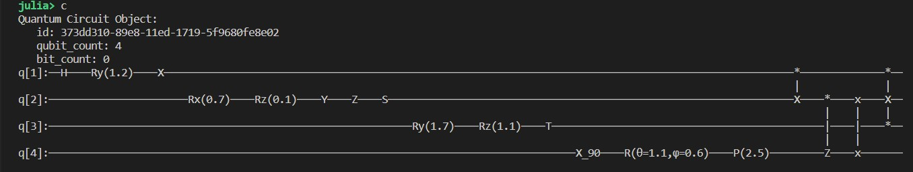
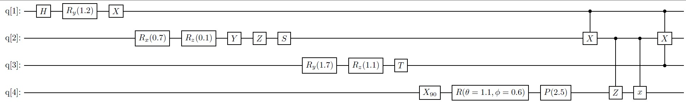

# Shovel Documentation


The Shovel package contains a set of useful functions for scientists using the Qube computer.

## shrun method

The goal of this method is to simplify life of quantum circuit designers. Since a quantum computer is probabilistic, a circuit must be run several time in order to get a good idea of the resulting proportion of each possible measurement outcomes.

So instead of guessing the sutable number of trial, the user of shrun is offered to define a confidence interval and a probability of being inside it. The function [`shrun`](@ref) will perform sequential shots of the circuit until it reached the desired level of confidence requested by the user.

The user has the possibility of defining a linear combinaison of the possible outcomes. If, for instance, the probability of {0,...0} (all zeros) is desired, then the linear combinasion \[1,0,...0\] will be used. If, on the other hand, we seek  the probability that the last qubit is equal to 0, than, all measurements ending with zero is to be estimated. Then, the proper linear combinasion is given by \[0,1,0,1,...0,1\] ("0,1" repeated).

```@docs
# Defined in Stop.jl
shrunresult
printshootresult
shrun
#shpush_gate!
```

## Meta Quantum Circuits (shMQC)

The idea of a meta quantum circuit is to help circuit designers to easily reuse already defined circuits. If, for instance, one has a circuit V producing a result that needs to be incerted into a larger circuit. It suffise to define how this circuit is "plugged" with the other elements and let [`shsew`](@ref) build the resulting circuit.

```@docs
# Defined in MQC.jl
Plug
Connector
isinverse
isbefore
Wire
ismember
shprintlightQC
shMQC
shMQCAddCircuit
shMQCAddConnector
printshMQC
shsew
shQuantumCircuit
```

## LaTeX utilities

Snowflake aloows to display a circuit on the screen. However, for scientific resaerch or educational purpose, it is often required to produce a LaTeX document. These utilities allow for a conversion of either a Snowflake circuit or a shMQC into Quantikz/Latex format.

Additionally, it is also possible to display the resulting operator of a circuit into textual forme. The resulting string matrix is often very large and difficult to read but elements of it can be inspected to better understand what is going on. This is usefull only on relatively small circuits and is of educational interest for beginners.

A typical Snowflake circuit such as the above.



```@raw html
<br style="line-height: 150%;"/>
```

Will appear like that once compiled as a Latex/Quantikz file.



```@docs
# Defined in ToLaTeX.jl
shLaTeX
shstrmult
shmult
shkron
shrx
shry
shr
shhadamard
shid
shcnot
shcnot1
shoperator
```

## Initprob utilities

If a quantum computer is simply viewed as a fancy random number generator, the question is: how can we design a circuit such that the measurements have the disired probability distribution. The library considers the measurements as random variable from a multinomial distribution. This distribution is used to approximate other distribution, discrete or continuous.

!!! info "Just beginning"
    This part is still at an early stage and will evolve quickly. Once I master the art of properly initializing a set of qubits it will grow faster.

!!! tip "Don't hold your breath"
    I need spare time to work on this.

```@docs
# Defined in Initprob.jl
shinit1qubit!
shinit2qubits!
ZYZdecomposition
```
